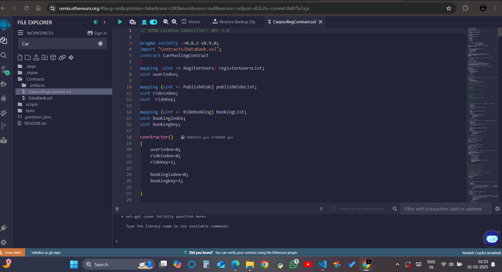
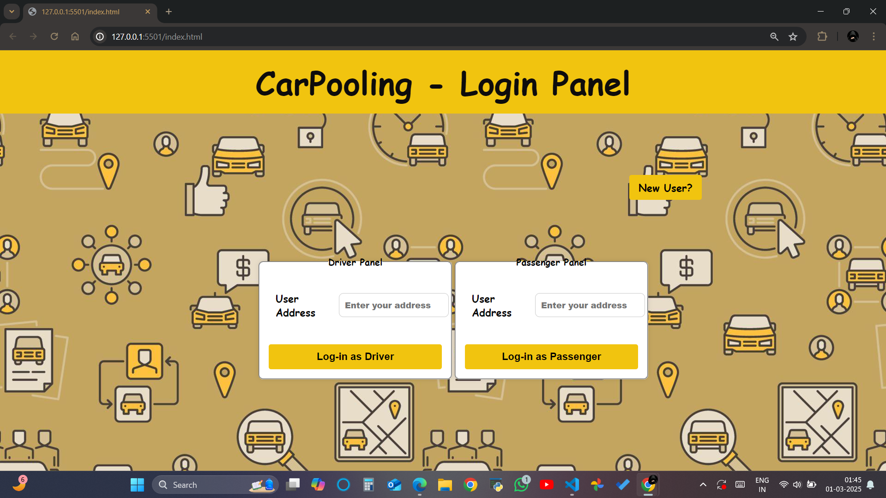
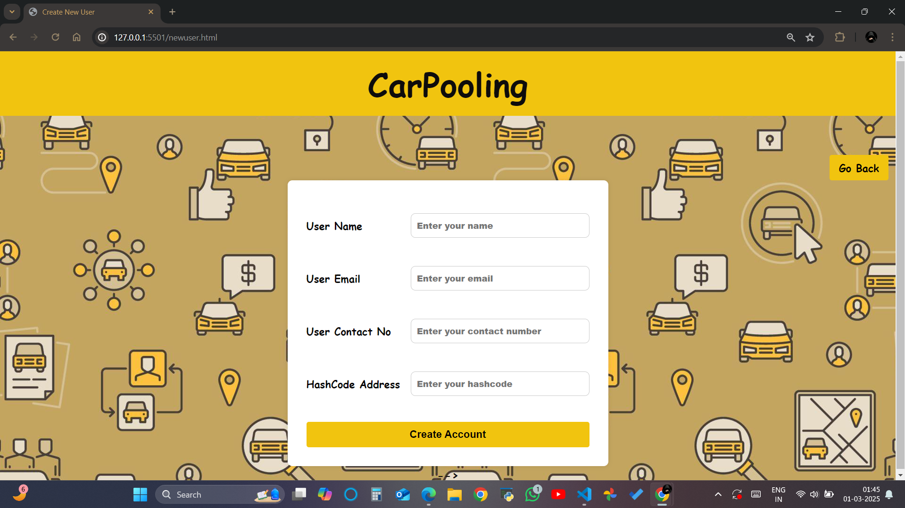
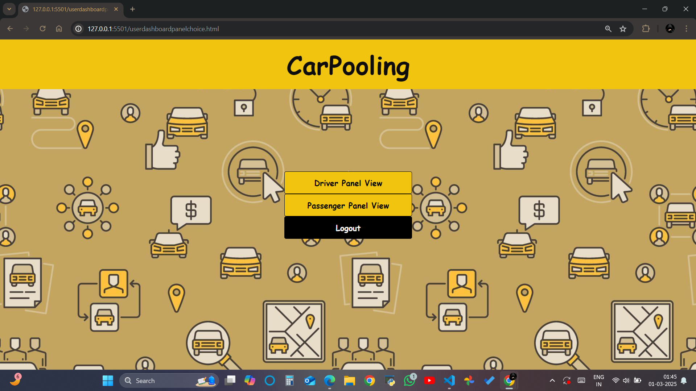

# Peer-to-Peer Carpooling using Blockchain

## Overview
This project decentralizes the traditional carpooling system by leveraging **blockchain technology**. It uses **Ethereum** for transactions, ensuring security, transparency, and immutability.

## Features
- Decentralized carpooling using blockchain
- Secure and transparent transactions with Ethereum
- Smart contracts for managing carpooling data
- Web3.js integration for interaction with blockchain

---
1. Remix IDE Smart Contract Deployment


### 2. Ganache Blockchain Setup


### 3.Login panel


### 4.New user


###5.User dashboard panel



---
## Steps to Run

### **1. Setting Up Remix IDE**
1. Open [Remix IDE](https://remix.ethereum.org/) in your browser.
2. Create a new workspace named **"CAR"**.
3. Select **Contracts** > Create two files:
   - `DataBank.sol`
   - `CarpoolingContract.sol`
4. Copy and paste the smart contract code from this repository.
5. Navigate to **Solidity Compiler**:
   - Select **Advanced Configuration**
   - In **EVM Version**, choose **'Paris'**
   - Compile the contract.

### **2. Setting Up Ganache**
1. Download Ganache: [Ganache Download](https://trufflesuite.com/ganache/)
2. After installation, click **'Quick Start'**.

### **3. Setting Up the Project Locally**
1. Create a new project folder **'CARPOOLING'**.
2. Open the terminal and run:
   ```sh
   npm install --save web3
   npm install web3.js-browser
   ```
3. Download all the code files from this repository into your project folder.

### **4. Deploying Smart Contracts**
1. In **Remix IDE**, navigate to **DEPLOY & RUN TRANSACTIONS**.
2. Set **ENVIRONMENT** to **'Custom-External Http Provider'**.
3. Change the **port** from `8545` to `7545` (matching Ganache settings).
4. Click **Deploy**.

### **5. Connecting Web3.js**
1. From **Solidity Compiler**, copy the **ABI** code and paste it into `web3connection.js`.
2. From **DEPLOY & RUN TRANSACTIONS**, copy the **deployed contract address** and paste it into `web3connection.js`.

### **6. Running the Web Application**
1. In **VS Code**, click on **'Go Live'**.
2. Open the browser and enter:
   ```
   localhost:5500
   ```
3. Use the **Ganache wallet address** to create a new user and log in.

## Technologies Used
- **Solidity** - Smart contract programming
- **Ethereum** - Blockchain platform
- **Ganache** - Local blockchain for testing
- **Remix IDE** - Smart contract development
- **Web3.js** - Interaction with Ethereum blockchain
- **HTML, CSS, JavaScript** - Frontend development


